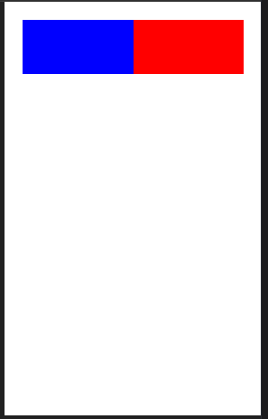
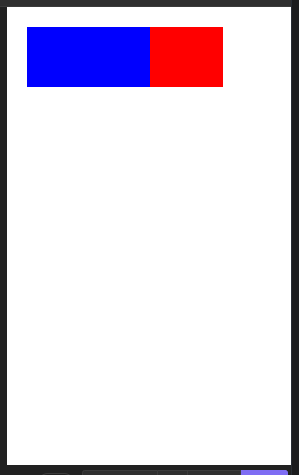
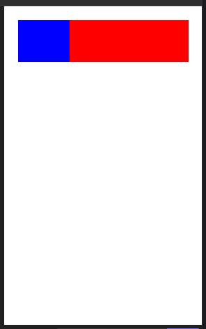

### 1. A `View` component can be nested inside other `Views`.

- [x] True.
- [ ] False.

### 2. Which of the following code blocks are correct and will not throw any errors?

- [x]

```
<View>
  <Text>
    Some text
  </Text>
</View>
```

- [ ]

```
<View>
  <Text>
    Some text
  </View>
</Text>
```

- [ ]

```
<View>
  Some text
</View>
```

- [x]

```
<View>
  <Text>Some text
    <Text> Some more text</Text>
  </Text>
</View>
```

### 3. Study the code below and select the image that best represents how the code will render on the emulator.

```
import React from "react";
import { View, Text } from "react-native";

const ViewBoxesWithColorAndText = () => {
  return (
    <View
      style={{
        flexDirection: "row",
        height: 100,
        padding: 20
      }}
    >
      <View style={{ backgroundColor: "blue", flex: 0.5 }} />
      <View style={{ backgroundColor: "red", flex: 0.3 }} />
    </View>
  );
};

export default ViewBoxesWithColorAndText;
```

- [ ] 
- [x] 
- [ ] 

### 4. Which of the following statements are true about the `ScrollView` component?

- [x] `ScrollView` component can have a bounded height by directly setting the `View`'s height.
- [ ] `ScrollView` is a core component that does not need to be bounded by height.
- [x] `ScrollView` component always needs a bounded height and can be set by providing all parent `Views` with a bounded height.

### 5. Study the code below and choose the correct output that you will expect to see on the emulator.

```
<Text style={{ fontWeight: 'bold' }}>
  I am bold
  <Text style={{ color: 'red' }}> and red</Text>
</Text>
```

- [ ] <span style="color:red"><b>I am bold and red</b>.</span>
- [x] <b>I am bold <span style="color:red"> and red</b>.</span>
- [ ] <span><b>I am bold and red</b>.</span>
- [ ] It will throw an error because nesting is not allowed in `Text` components.
